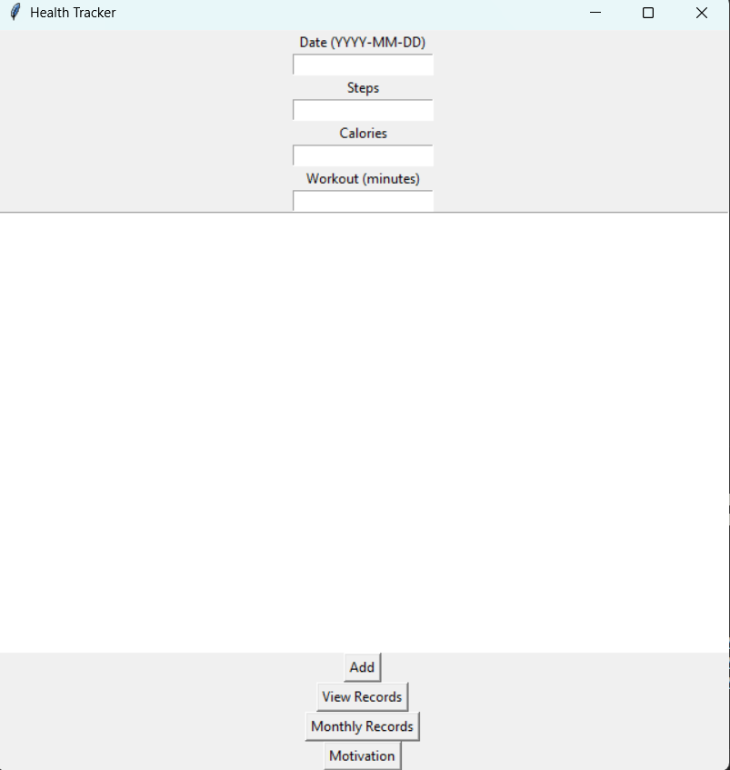
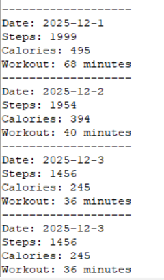

# HealthTrackingSystem

HealthTrackingSystem is a simple Python Tkinter application that allows users to record daily health information such as date, steps taken, calories burned, and workout duration. All data is stored in a text file and can be viewed at any time. The application also includes a motivational message feature.

## Features
- Add daily health records (Date, Steps, Calories, Workout Minutes)
- View all stored records
- View last 30 entries (Monthly Records)
- Show motivational messages
- Simple Tkinter GUI
- Stores data in a text file

## Project Structure
```
HealthTrackingSystem/
│── HealthTrackingSystem.py
│── data.txt
│── README.md
│── requirements.txt
│── screenshots/
```


markdown
Copy code

## Technologies Used
- Python 3
- Tkinter
- Random module
- Text file handling

## Installation and Usage


### 1. Clone the repository:
```
git clone https://github.com/chupkarlakshya/HealthTrackingSystem.git
```

### 2. Navigate into the folder:
```
cd HealthTrackingSystem
```

### 3. Install dependencies:
```
pip install -r requirements.txt
```

### 4. Run the application:
```
python HealthTrackingSystem.py
```


## How the Application Works

Users enter:
- Date
- Steps
- Calories
- Workout minutes

### Main GUI


When **Add** is clicked, the data is stored in `data.txt` in this format:
Date
Steps
Calories
Workout
END

markdown
Copy code

Users can:
- View all entries
- View the last 30 entries
- Get a motivational message

### Displaying Stored Data


All output appears in the text area of the application.

## Testing
- Verified file writing and reading
- Tested monthly data extraction
- Checked behavior when file is missing
- Verified correct functioning of GUI buttons

## Future Enhancements
- Add charts or graphs
- Add edit or delete options
- Switch to SQLite database
- Improve UI layout
- Add weekly or monthly statistics

## Author
Lakshya Jain

##**Contribution**
Contributions are welcome! Please open issues or pull requests for new features or bugs.

## License
This project is open source and available under the MIT License.


